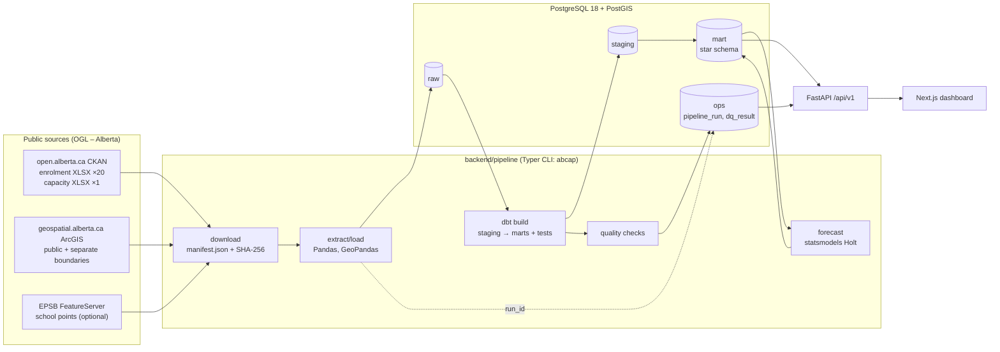

# Architecture

```mermaid
flowchart LR
    subgraph Sources["Public sources (OGL – Alberta)"]
        CKAN["open.alberta.ca CKAN<br/>enrolment XLSX ×20<br/>capacity XLSX ×1"]
        GIS["geospatial.alberta.ca ArcGIS<br/>public + separate boundaries"]
        EPSB["EPSB FeatureServer<br/>school points (optional)"]
    end

    subgraph Pipeline["backend/pipeline (Typer CLI: abcap)"]
        DL["download<br/>manifest.json + SHA-256"]
        LOAD["extract/load<br/>Pandas, GeoPandas"]
        DBT["dbt build<br/>staging → marts + tests"]
        DQ["quality checks"]
        FC["forecast<br/>statsmodels Holt"]
    end

    subgraph DB["PostgreSQL 18 + PostGIS"]
        RAW[(raw)]
        STG[(staging)]
        MART[(mart<br/>star schema)]
        OPS[(ops<br/>pipeline_run, dq_result)]
    end

    API["FastAPI /api/v1"]
    WEB["Next.js dashboard"]

    CKAN --> DL
    GIS --> DL
    EPSB --> DL
    DL --> LOAD --> RAW --> DBT --> STG --> MART
    DBT --> DQ --> OPS
    MART --> FC --> MART
    LOAD -. run_id .-> OPS
    MART --> API --> WEB
    OPS --> API
```

**Status (Phase 0):** the download step, Compose (db and backend), and `/api/v1/health` are built. The other boxes are planned for the phases in `SPEC.md`.
